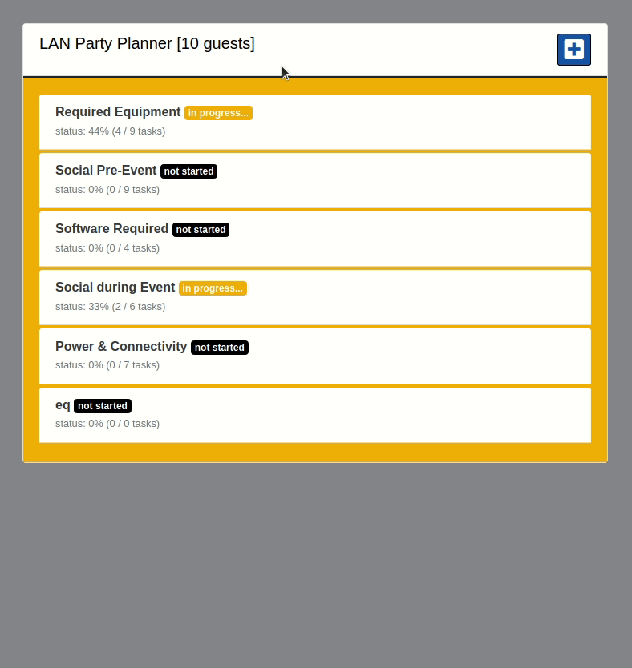

## LAN Tournament planner app - live state and styles updates.

---

---

## Stack

*  as language.
*  as framework.
*  as database.
*  for deployment in production.
*  a CSS framework.
*  for Front-End styling.
*  for Front-End styling.
*  for scripts and Front-End styling.
*  for Front-End styling.
* **nested-scaffolds** for nested models.
* **Redis** as a dependency for StimulusReflex and for Heroku.
* **StimulusReflex** for reactive real time updates with reflexes by intercepting user interactions and passing them to Rails over real-time websockets that change the application state.
* **CableReady** to broadcast DOM updates from multiple clients at once using **ActionCable**, notify the users and update the UI, real time updates for posts.
* **Font-Awesome** as an icon toolkit 
* **better_errors** gem in development

---

## Configuration & dependencies

### System dependencies

`Ruby: 2.7.2p137`

`Rails: 6.0.3.4`

`Redis: 4.2.5`

`database: postgresql`

### Configuration

`git clone https://github.com/tmtocb/LANtournament-rails-stimulusreflex`

`bundle install`

install stimulus_reflex: `bundle exec rails stimulus_reflex:install`

### Empty database

`rails db:drop db:create db:migrate`

### Run the app

`rails s`